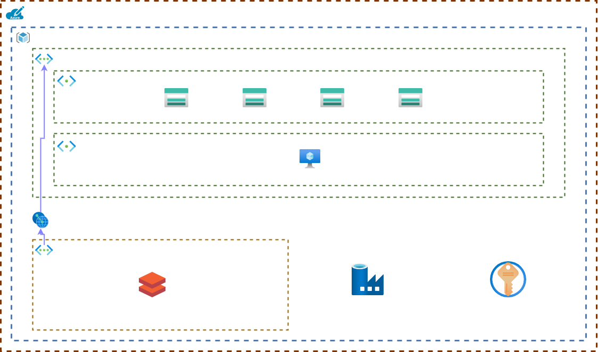

# Enterprise Data Platform
### Version: 1.0
### Author: Nicholas Ward (24/03/2024)
This repository contains the infrastructure as code (IaC) for a basic Azure Data Platform. 

It consists of bicep templates that define the infrastructure as well as pipelines and scripts for deployment.

# Usage
Deployment is subscription targeted. Note location here is not used but is a required parameter.
1. Login with portal 

    `az login`

2. Preview changes

    `az deployment sub what-if -l australieast -p ./parameters/dev.bicepparam -f/dev.main.bicep --exclude-change-types Ignore, NoChange`

3. Validate the changes 

    `az deployment sub validate -l australieast -p ./parameters/dev.bicepparam -f/dev.main.bicep`

4. Execute changes

    `az deployment sub create -l australieast -p ./parameters/dev.bicepparam -f/dev.main.bicep`

# High Level Architecture
* Separate environments by resource groups
* Single core virtual network per environment with subnets for storage and ingestion
* Separate virtual network for Databricks peered into core

